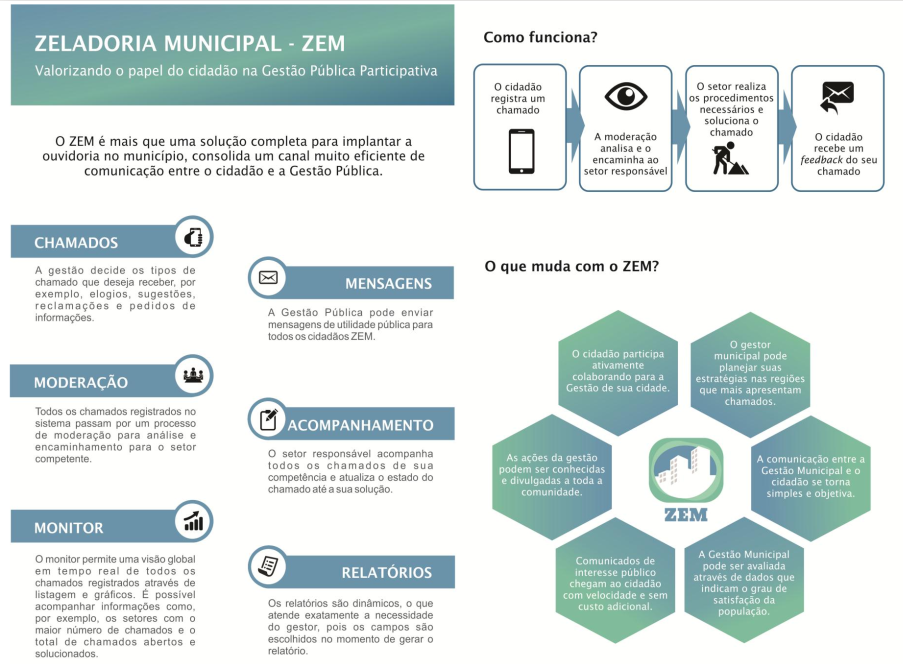

# ZEM - Zeladoria Municipal

[Vídeo sobre o projeto](https://www.youtube.com/watch?v=lrHPzcIGjq0&t=1s)

**Chamada Pública** : Chamada CNPq-SETEC/MEC No 17/2014 - [Acesse o edital aqui](Edital-ChamadaCNPq-SETEC-MEC-17-2014.pdf)

**Processo** : 468005/2014-5

**Coordenador do Projeto** : Daniel Cintra Cugler

Este projeto foi co-coordenado pelas pesquisadoras Jaqueline Aparecida Jorge Papini Soares e Lídia Bononi Paiva Tomaz, no IFTM, Instituto Federal do Triângulo Mineiro, *campus* Patrocínio/MG.

O código fonte do projeto pode ser utilizado desde que sejam seguidas as normas do CNPq ([vide edital](Edital-ChamadaCNPq-SETEC-MEC-17-2014.pdf))

O sistema encontra-se em estado funcional, no entanto, existem *bugs* que precisam ser solucionados.

Não há um manual de instalação completo e totalmente validado neste momento, no entanto, existe um conjunto de instruções (disponíveis a seguir) para auxiliar no processo de instalação.

Os códigos fontes necessários estão disponíveis em:

- [(A) Projeto Web principal](https://github.com/danielcugler/zem/tree/master/zeladoria-all)
- [(B) Projeto Web Service - Hub direcionador de Cidades/IPs](https://github.com/danielcugler/zem/tree/master/branches/admin)
- [(C) Projeto Mobile](https://github.com/danielcugler/zem/tree/master/branches/V2/ZemMobileIonic)
- [(D) Script do banco de dados do projeto Web Principal](https://github.com/danielcugler/zem/blob/master/branches/Database%20Generator/FullBackup.sql)

## Resumo
Cidadãos podem utilizar tanto a app mobile quanto o módulo web para abrir chamados. Tanto o módulo web quanto app mobile contactam o web service (B) para saber qual o IP do servidor que roda o projeto Web principal. 

## PORTAS QUE PRECISAM ESTAR LIBERADAS NO SERVIDOR
80, 8080, 8081, 22, 5432, 9000, 587 e 25  

## Instalando o MINIO ([download here](https://min.io/))
sudo mkdir /minio
sudo chmod 777 /minio
cd /minio
wget https://dl.minio.io/server/minio/release/linux-amd64/minio
chmod +x minio

sudo mkdir /srv/
sudo mkdir /srv/images
sudo mkdir /srv/images/user
sudo mkdir /srv/images/call 

sudo chmod 777 /srv/images
sudo chmod 777 /srv/images/user
sudo chmod 777 /srv/images/call

Executar o comando abaixo. Em seguida serão exibidas algumas informações. Copie e armazene em algum lugar os dados que aparecerão de ACCESSKEY e SECRETKEY (serão utilizados posteriormente)

/minio/./minio server /srv/images

Assim que copiadas as informações, pressionar CTRL+C para cancelar a execução do serviço.

Baixar uma figura qualquer da internet em formato JPG, renomear como "root.jpg" e copiar em "/srv/images/user" (para o sistema nao ficar reclamando da figura do usuario root)

sudo chmod 755 /srv/images/user/root.jpg

Adicionar carregamento automatico do minio:

crontab -e (vai abrir no editor). Na última linha do arquivo aberto adicionar:
@reboot /minio/./minio server /srv/images

Pronto! Para testar se o serviço subiu no startup, reiniciar o servidor e abrir um browser no endereco: "IP_SERVIDOR:9000"

## INSTALANDO O POSTGRES
sudo apt-get install postgresql (usei o postgres 10 nos testes)

## RESTAURANDO O BANCO DE DADOS DO MÓDULO WEB DA PREFEITURA (A)
- No Postgresql, criar um banco vazio chamado "zem". Utilizar o o script "FullBackup.sql", em (D).
O arquivo está com encoding ANSI. No linux ele dá erro ao abrir. Para resolver o problema, pode-se abrir o arquivo no bloco de notas do windows e escolher "salvar como" - neste momento, é possivel selecionar o encoding - escolher UTF8.

Para restaurar o backup, por conta do arquivo ser grande, se tentar utilizar o pgadmin este vai travar. Entao, utilizar linha de comando:
sudo su postgres
psql -U postgres -d zem --set ON_ERROR_STOP=on -f ~/Desktop/FullBackupUTF.sql 

## Instalando o web service central das cidades (B)
Instalado o Tomcat/9.0.22

Usando o seguinte tutorial: https://www.digitalocean.com/community/tutorials/install-tomcat-9-ubuntu-1804
(instalando diretamente por apt-get install... deu problemas - o servico do tomcat rodava, mas qualquer pagina ficava inacessivel mesmo que localmente)

- Mudar a porta do tomcat de 8080 para a porta 8081.

- sudo vi /opt/tomcat8/conf/server.xml

Change port From: <Connector port="8080"
              To: <Connector port="8081"

- sudo systemctl start tomcat

Criar no postgres do mesmo servidor um banco com nome "zem-ws-central"

Baixar o código fonte em (B)

Alterar o arquivo de conexão com banco: src/main/resources/hibernate.cfg.xml com as novas credenciais

Ainda em hibernate.cfg.xml, em "hbm2ddl.auto", de "validate", mudar para "create" para que as tabelas sejam criadas.

Compilar o projeto. Entrar no diretorio raiz do projeto e executar: mvn clean install

- No diretorio webapps do tomcat, excluir o diretorio ROOT

- Renomear o arquivo recem-criado em admin/target/admin-0.0.1-SNAPSHOT.war para ROOT.war. 

- Copiar o ROOT.war para o diretorio webapps do tomcat.

- Acessar a URL http://IP_SERVIDOR:8081/rest/city para testar se vai retornar um array vazio.

- Entrar no arquivo "src/main/resources/hibernate.cfg.xml" e voltar o atributo "hbm2ddl.auto" para "validate" novamente.

- Deletar o arquivo ROOT.war do diretorio webapps do tomcat, compilar novamente o projeto, copiar o novo .war para o webapps do tomcat e subir o servico do tomcat.

- Acessar o banco zem-ws-central (via pgadmin) e adicionar manualmente dados para as tabelas

## INSTALANDO O JETTY 9 (PORTA 8080) - RODA O MODULO WEB PRINCIPAL DA PREFEITURA
sudo apt-get install jetty9

Configurar o carregamento automatico do jetty:

crontab -e (vai abrir no editor). Na última linha do arquivo aberto adicionar:
@reboot /etc/init.d/jetty9 start

## INSTALANDO O SISTEMA WEB PRINCIPAL - MODULO PREFEITURA (JETTY - PORTA 80)

Fazer download do código fonte em (A) - zeladoria-all"

- Procurar dentro do projeto todas as referências a "souzem.com.br" e modificar para "seu_novo_dominio". Se utilizar apenas IP no lugar de souzem.com.br, vai dar problema de carregamento de imagens no MINIO. 

Configurar os dados de acesso ao banco que já foi criado, "zem". Apontar para "localhost". Modificar apenas usuário e senha em:
- /model/src/main/resources/hibernate.cfg.xml
- /model/src/main/resources/hibernate4.cfg.xml
- /front-end/src/main/webapp/WEB-INF/spring-security.xml

** ATENCAO - NAO UTILIZAR CTRL+C E CTRL+V PARA EDITAR AS SENHAS NESSES ARQUIVOS. TIVE PROBLEMAS AO FAZER ISSO - O SISTEMA NAO LOGAVA NO BANCO.

- Editar "/front-end/src/main/java/zup/utils/MinioServer.java"
- Pegar os dados ACCESSKEY e SECRETKEY salvos na instalacao do minio e alterar neste arquivo.
  Exemplo:return new MinioClient("http://SEU_DOMINIO:9000", "0YZ6P3PYVY1IWT0VQB8H","lbYkAGdqq+biDIb4dIo+Lna4tJ46+jTwYmBl5OhO");

******** IMPORTANTE! TEM QUE COLOCAR O IP VALIDO DO SERVIDOR SENAO NAO FUNCIONA

- Entrar no diretorio "zeladoria-all" e rodar --> mvn clean install

- Renomear o arquivo .war gerado em front-end/target/front-end.war para root.war

- Excluir o diretório /var/lib/jetty9/webapps/root

- Copiar root.war para o diretório /var/lib/jetty9/webapps/

- sudo chmod 777 /var/lib/jetty9/webapps/root.war

- sudo vi /tmp/zem_errors.log (criar arquivo vazio)

- sudo chmod 777 /tmp/zem_errors.log 

- sudo mkdir /usr/share/jetty9/log

- sudo chmod 777 /usr/share/jetty9/log

- sudo /etc/init.d/jetty9 start

Pronto! Acessar o endereco: localhost:8080/login.jsp (outra opcao é /identification.jsp) - logar com o usuario "root" e senha "123456ab".

## Instalando a app mobile (ionic)
Fazer download do código fonte em (B).

Tutorial de instalação ainda não definido.